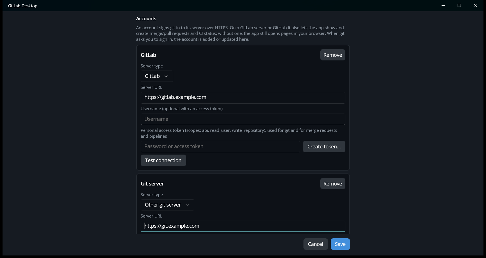
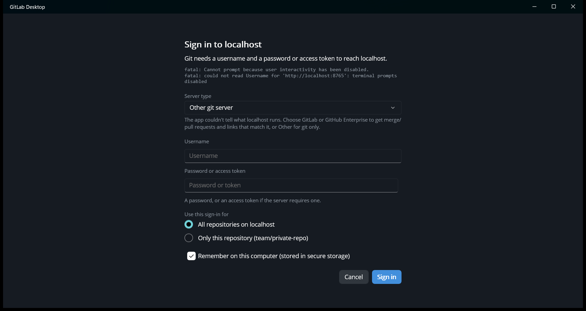

# Accounts and signing in

An account tells the app how to sign in to a server. Accounts are managed in **File › Options › Accounts**. There are
three kinds:

| Kind | Used for | Add with |
| --- | --- | --- |
| **GitLab** | Signing git in to that GitLab server, plus listing your projects when cloning, creating merge requests, and showing pipelines. You can add as many GitLab servers as you like. | **+ Add GitLab account** |
| **GitHub** | The same for github.com: git, cloning from your repositories, pull requests and checks. One github.com account. | **+ Add GitHub account** |
| **Git server** | Signing git in to any other server over HTTPS, such as Gitea, Bitbucket Server or your own git host. Git only, with no merge/pull requests or CI. | **+ Add Git server account** |

Passwords and tokens are kept in the operating system's secure storage (Windows Credential Locker, the macOS
Keychain or the Android Keystore), not in a plain settings file. Git receives them through its environment, so they
never appear on a command line or in the [git command log](troubleshooting.md#the-git-command-log).

Without any account, everything that only needs your browser still works: **View on GitLab/GitHub**, comparing
branches, and opening merge/pull requests in the browser.

## Adding a GitLab account

1. **File › Options › + Add GitLab account**.
2. **Server URL**: your server's address, for example `https://gitlab.example.com`.
3. **Create token…** opens your server's *Personal access tokens* page with the name and scopes already filled in:
   `api`, `read_user` and `write_repository`. Set an expiry date, create the token and copy it.
4. Paste it into **Password or access token**. The username can stay empty.
5. **Test connection** should show *✓ Signed in as …*. Then **Save**.

## Adding a GitHub account

1. **File › Options › + Add GitHub account**.
2. **Create token…** opens GitHub's *New personal access token (classic)* page with the `repo`, `workflow` and
   `read:user` scopes selected. Create the token and copy it.
3. Paste it into **Password or access token**, then **Test connection** and **Save**.

For repositories owned by an organization that restricts personal access tokens, an organization owner may need to
approve the token, or the token's resource owner must be the organization.

## Adding another git server

1. **File › Options › + Add Git server account**.
2. **Server URL**: the server's address, for example `https://git.example.com`.
3. **Username** and **Password or access token**, as you would type them for `git clone` on the command line.
4. **Save**.

The account is used for every repository whose remote is on that server.

## When git asks you to sign in

If a fetch, pull, push or clone over HTTPS has no sign-in for the server, or the server rejects the saved one, the
app asks for one and then retries:

- **Server type** appears only when the app couldn't tell what the server runs, for example because its API isn't
  reachable. Choose **GitLab** to get **Create token…**, merge requests and pipelines for that server, or
  **GitHub Enterprise** for GitHub's wording and links. Choose **Other git server** for git only. When the type is
  known, the prompt just states it.
- **Username** and **Password or access token**. GitHub needs a token here, not your password. On GitLab, the
  username can be left empty when you use a token.
- **Create token…** (GitLab and github.com) opens the token page, as in Options.
- **Use this sign-in for**:
  - **All repositories on *server***: the usual choice.
  - **Only this repository**: when one repository on the server needs a different user. For example, a deploy or
    bot account, or a project you reach with a second login. That repository's sign-in takes priority over the
    server's.
- **Remember on this computer**: saves it in secure storage. Untick it to keep the sign-in only until the app exits.
  Options marks such accounts with *until the app exits*.

If a saved sign-in is rejected, for example because the token expired, the heading reads *Sign-in to … failed*. Enter
the new details to replace it, or **Cancel** to leave the saved account unchanged.

Sign-ins entered here show in **Options › Accounts**, where you can change or **Remove** them. Each account except
github.com also has a **Server type**, so a server saved as the wrong type can be corrected there. For a GitLab server
installed under a path, such as `https://example.com/gitlab`, check that the **Server URL** includes the path. A sign-in for a
GitLab server or github.com with an access token also enables merge/pull requests and CI for that server.

## SSH

Repositories cloned over SSH (`git@server:group/project.git`) use your SSH keys and agent as usual, and never show the
sign-in prompt. To clone over SSH by default, turn on **Options › Clone with SSH instead of HTTPS**. An access token is
still needed for merge/pull requests and CI.

## Git Credential Manager

If Git Credential Manager (included with Git for Windows) already has a login for a server, git keeps using it. The app
stops it from opening its own sign-in windows, so you're only ever asked once, by the app.
