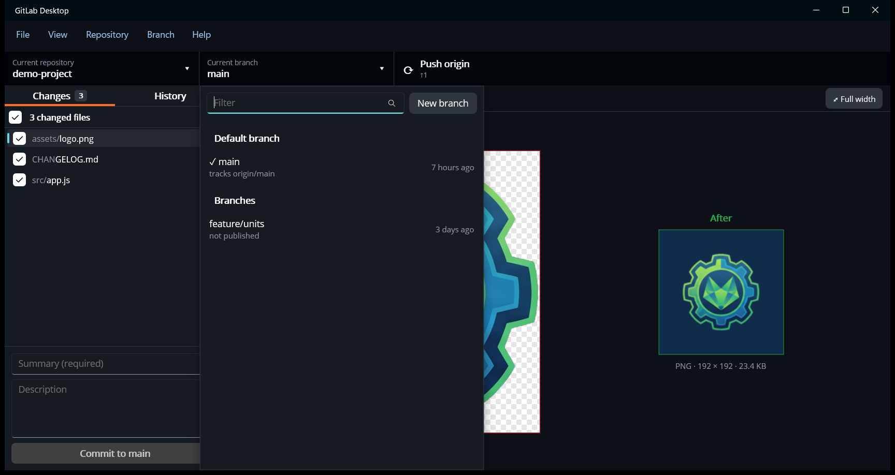

# Branches, merge requests and pull requests

## Switching branches

Click **Current branch** in the toolbar (or **View › Branches list**, Ctrl+B):

Branches are grouped into the **Default branch**, your other local **Branches**, and **Remote branches** that you don't
have a local copy of yet. Each one shows the branch it tracks (or *not published*) and when it last had a commit. The
current branch has a ✓.

Click a branch to switch to it. Type in **Filter** and press Enter to switch to the first match. Choosing a remote
branch creates a local branch that tracks it. If you have uncommitted changes, you're asked whether to
[leave them on the current branch or bring them along](making-changes.md#switching-branches-with-uncommitted-changes).

## Branch menu

| Item | What it does |
| --- | --- |
| **New branch…** (Ctrl+Shift+N) | Creates a branch from the current commit and switches to it. Also available as **New branch** in the branch list. Spaces and characters git doesn't allow are replaced. |
| **Rename…** (Ctrl+Shift+R) | Renames the current branch. |
| **Delete…** (Ctrl+Shift+D) | Pick a local branch to delete. If it's published, you can delete just the local branch or the server's copy as well. |
| **Discard all changes…** / **Stash all changes** / **Restore stashed changes…** | See [Undoing and setting aside changes](making-changes.md#undoing-and-setting-aside-changes). |
| **Update from *default branch*** (Ctrl+Shift+U) | Fetches, then merges the server's default branch (for example `origin/main`) into the current branch. |
| **Compare to branch on *GitLab/GitHub*** (Ctrl+Shift+B) | Pick a branch, then see the comparison on the server. |
| **Merge into current branch…** (Ctrl+Shift+M) | Pick a branch to merge into the current one. |
| **Squash and merge into current branch…** (Ctrl+Shift+H) | Brings another branch's changes in as uncommitted changes, with a commit message prepared from its commits. Review them in Changes, then commit. |
| **Rebase current branch…** (Ctrl+Shift+E) | Pick a branch to replay the current branch's commits on top of. Commit or stash your changes first. |
| **Continue merge / rebase** / **Abort merge / rebase…** | See [Conflicts](#conflicts). |
| **Compare on *GitLab/GitHub*** (Ctrl+Shift+C) | The current branch compared with the default branch, on the server. |
| **View branch on *GitLab/GitHub*** (Ctrl+Alt+B) | The current branch's page on the server. |
| **Create merge request / pull request** (Ctrl+Alt+P) | See [below](#merge-requests-and-pull-requests). |
| **View merge request / pull request** (Ctrl+R) | Opens the current branch's open merge/pull request. |
| **View pipeline / checks** | Opens the latest CI run for the current branch. |

The wording follows the server: GitLab repositories get *merge requests* and *pipelines*, and GitHub repositories get
*pull requests* and *checks*. See [GitLab, GitHub and other servers](gitlab-and-github.md).

## Merge requests and pull requests

With a GitLab or GitHub [account](accounts.md) for the server, **Branch › Create merge request** (or
**Create pull request**) opens a form in the app:

- **Source branch *into* target branch**: the target defaults to the default branch, and you can pick another.
- **Title** and **Description (Markdown)**: for a single commit, its summary and description. For several commits,
  the title comes from the branch name and the description lists the commits.
- **Mark as draft**, **Assign to me**.
- GitLab only: **Delete source branch when merged** and **Squash commits when merged**.
- **Open in browser after creating**.
- The commits that will be included are listed underneath.

If the branch hasn't been pushed yet, or has unpushed commits, the app offers to push it first. **Open in browser
instead** uses the server's own form. Without an account, the menu item always opens the server's form in your
browser.

Once a branch has an open merge/pull request, the toolbar shows its number next to the branch name: `!12` on GitLab,
`#12` on GitHub. The branch's latest CI status appears beside it: ✓ passed, ✗ failed, ● running, ◌ pending, ⊘
canceled or skipped. Hover over it for the exact status. Click the number to open the request, or the status to open
the pipeline or checks.

## Conflicts

If a merge, rebase, cherry-pick or revert stops because of conflicts, a banner appears under the toolbar, and the
conflicted files are marked in the Changes tab.

1. Open each conflicted file in your editor and resolve the conflict markers (`<<<<<<<`, `=======`, `>>>>>>>`). Save
   the file.
2. Back in the app, click **Continue** in the banner (or **Branch › Continue merge / rebase**). Continue adds all your
   changes and carries on, so make sure everything in the Changes tab belongs in the result. While any file is still
   marked as conflicted, the app asks you to resolve it first.

**Abort** (or **Branch › Abort merge / rebase…**) puts the branch back the way it was before you started.
