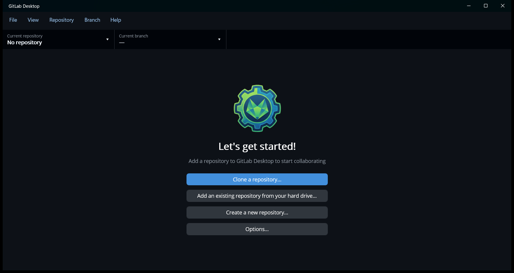

# Getting started

## Install

Download the latest version from this project's **Releases** page (on GitLab: *Deploy › Releases*; on GitHub: *Releases*
on the right of the repository page).

| Platform | Download | Notes |
| --- | --- | --- |
| Windows 10/11 (x64) | `GitLabDesktop-v<version>-win-x64-setup.exe` | Recommended. Installs for all users, adds Start menu shortcuts, and lets the app update itself. |
| Windows on ARM | `GitLabDesktop-v<version>-win-arm64-setup.exe` | As above, for ARM64 PCs. |
| Windows (portable) | `GitLabDesktop-v<version>-win-x64.zip` or `-win-arm64.zip` | Unzip anywhere and run `GitLabDesktop.exe`. Updates open the download page instead of installing. |
| macOS 11 or later | `GitLabDesktop-v<version>-macos.dmg` | Universal (Apple silicon and Intel). Drag the app to Applications. If the build isn't notarized, right-click it and choose **Open** the first time. |
| Android | `GitLabDesktop-v<version>-android-preview.apk` | Preview only, see below. |

### Git is required

The app runs the `git` command line, so your existing git config, hooks and SSH keys all apply.

- **Windows**: install [Git for Windows](https://git-scm.com/download/win).
- **macOS**: run `xcode-select --install` in Terminal to get Apple's command line tools, which include git.

If git is somewhere unusual, set its path in [Options › Tools](options.md#tools).

### Android preview

The Android app installs and opens, but phones have no git command line, so cloning, committing and syncing don't
work yet. It's published so the interface can be tried on a phone or tablet.

## First run



With no repositories yet, the app offers to:

- **Clone a repository…**: download one from a server. See [Cloning](repositories.md#clone-a-repository).
- **Add an existing repository from your hard drive…**: use a folder you already cloned.
- **Create a new repository…**: start an empty one.
- **Options…**: add your accounts first. See [Accounts](accounts.md).

Repositories already in your [repositories folder](repositories.md#the-repositories-folder) (`Documents\GitLab` by
default) are added automatically. If you use GitHub Desktop, **Options › Use GitHub Desktop folder** picks up
everything in `Documents\GitHub` as well.

A good order for a new setup is:

1. **File › Options › Accounts**: add your GitLab server or GitHub account with an access token. This lets the app
   list your projects when cloning, and show merge/pull requests and CI.
2. **File › Clone repository…**: pick a project.
3. Make changes in your editor, then commit and push them from the [Changes tab](making-changes.md).

You can also open a repository directly from a terminal or a shortcut:

```sh
GitLabDesktop.exe C:\path\to\repository
```

## Updates

The app checks for a new version when it starts and from **Help › Check for updates…**. When one is available you can:

- **Install and restart** (Windows installer copies): the new installer is downloaded, its signature is checked, and
  the app closes while an "Updating GitLab Desktop" window shows the install's progress, then starts again.
- **Download update** or **Open download page** (portable Windows copies, macOS and Android): the download opens in
  your browser. Your settings are kept when you install over the old version.
- **Skip this version**: the startup check stops offering it. Newer versions are still offered, and
  **Help › Check for updates…** still shows a skipped version.
- **Later**: ask again next time.

**Release notes** and **Release page** show what changed.

Turn the startup check off, or opt in to pre-releases (versions such as `0.3.0-rc.1`), in
[Options › Updates](options.md#updates).
