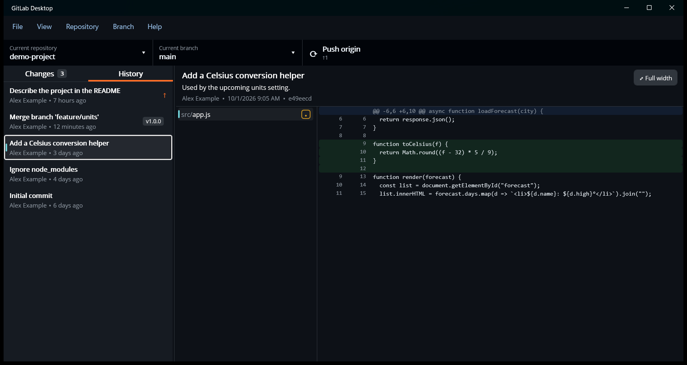

# History

The **History** tab (View › History, Ctrl+2) lists the current branch's commits, newest first. More load as you
scroll.

- Tags are shown as labels on their commit.
- Commits that haven't been pushed yet have an **↑** marker.
- Click a commit to see its summary, description, author, date and SHA. The files it changed appear in the middle
  column, and the selected file's diff on the right. Changed images are shown as
  [pictures](making-changes.md#image-changes).

The middle column can be resized by dragging its divider, and **Full width** (Ctrl+3) hides both lists.

## Commit actions

Right-click a commit for:

| Item | What it does |
| --- | --- |
| **Amend commit…** | Edit the most recent commit from the Changes tab. If it was already pushed, you're warned that amending rewrites history and needs a force push. |
| **Reset to commit…** | Moves the branch back to this commit. Later commits are undone, but their changes are kept as uncommitted changes. |
| **Checkout commit** | Checks out this commit without a branch (a "detached HEAD"). Create a branch if you want to keep new commits made there. |
| **Revert changes in commit** | Makes a new commit that undoes this one. |
| **Create branch from commit** | A new branch starting at this commit. |
| **Create tag…** | Tags this commit. |
| **Cherry-pick commit…** | Pick the branch to apply this commit to (the current branch is listed first). Choosing another branch switches to it first, asking about uncommitted changes as usual. |
| **Copy SHA** / **Copy tag** | Copies the commit's full SHA or its tag. |
| **Copy commit as patch** | Copies the commit as `git show` prints it: author, date, message and diff. Handy for asking an AI assistant about a change. |
| **View commit in browser** | Opens the commit on GitLab, GitHub or the server. |

## Files in a commit

Right-click a file in a commit's file list for **Show in Explorer**, **Open in editor** and **Open with default program**
(these use the file in your working folder, if it's still there), **Copy diff** (that file's change in this commit),
**Copy file path**, **Copy relative file path**, and **View on GitLab/GitHub**, which opens the file as it was in this
commit.

If a revert or cherry-pick stops with conflicts, see
[Conflicts](branches-and-requests.md#conflicts).
