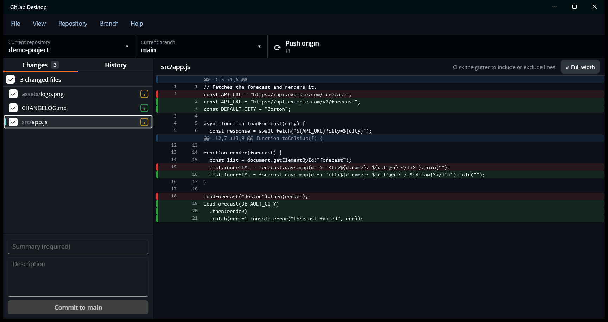

# Making changes

The **Changes** tab (View › Changes, Ctrl+1) lists every file that differs from the last commit. The number on the tab
is how many there are.

Click a file to see its diff on the right. Removed lines are red and added lines are green. **Full width** (or
**View › Full-width diff**, Ctrl+3) hides the file list so the diff gets the whole window. Click it again to bring the
list back.

Drag the divider between the list and the diff to resize them. The width is remembered.

## Choosing what to commit

- **Whole files**: tick or untick the checkbox next to each file. The checkbox in the *N changed files* header ticks or
  unticks them all.
- **Single lines**: click the gutter (the line numbers) next to a changed line to include or exclude just that line.
  Click a hunk header (`@@ … @@`) to include or exclude the whole hunk. A file with only some lines included is marked
  *partial*.

Only what's ticked goes into the commit. Everything else stays as an uncommitted change in your working folder.

## Committing

1. Type a **Summary** (required): a short line describing the change.
2. Add a **Description** if it needs more explanation.
3. Click **Commit to *branch***.

The commit is made locally. Use **Push origin** in the toolbar to send it to the server (see [Syncing](syncing.md)).

To change the most recent commit instead, right-click it in [History](history.md) and choose **Amend commit…**. The
Changes tab then shows *Amending the last commit*: its summary and description are filled in, and committing replaces
it with your edits and any changes you tick. **Cancel** stops amending.

## Image changes

Changed images (PNG, JPEG, GIF, BMP, ICO, WebP and TIFF) are shown as pictures instead of *Binary file changed*:

- A changed image shows **Before** (framed in red) and **After** (framed in green) side by side.
- A new image shows **Added**, and a deleted one shows **Deleted**.
- Images sit on a checkerboard so transparent areas are visible, and are shrunk to fit but never enlarged.
- Under each image are its format, size in pixels and file size.
- For icons (`.ico`), the largest image in the file is shown.

Images larger than 50 MB aren't previewed. Image files are always committed whole.

## Undoing and setting aside changes

Right-click a file for:

| Item | What it does |
| --- | --- |
| **Discard changes…** | Throws away your changes to that file, after asking. This can't be undone. |
| **Ignore file (add to .gitignore)** | Adds the file to `.gitignore` so git stops listing it. |
| **Ignore all files with this extension** | Adds `*.ext` to `.gitignore`. |
| **Copy diff** | Copies this file's changes as a unified diff (patch), ready to paste into an AI assistant, an issue or a chat. |
| **Copy file path** / **Copy relative file path** | Copies the full path, or the path within the repository. |
| **Show in Explorer / Finder** | Opens the folder with the file selected. |
| **Open in editor** | Opens the file with your [editor command](options.md#tools). |
| **Open with default program** | Opens the file with the program your system uses for that type. |

Right-click the *N changed files* header (or use the **Branch** menu) for:

- **Discard all changes…**: throws away every uncommitted change, after asking.
- **Copy all changes as patch**: copies every uncommitted change, new files included, as one unified diff.
- **Stash all changes** (Ctrl+Shift+S): sets every change aside and leaves the working folder clean. Bring the changes
  back later with **Branch › Restore stashed changes…**, which lists your stashes.

## Switching branches with uncommitted changes

If you switch branch while you have changes, the app asks what to do with them:

- **Leave my changes on *current branch***: they're stashed and tied to that branch. When you come back to it, the app
  offers to restore them.
- **Bring my changes to *new branch***: they move with you, like `git checkout` does.

## When there's nothing to commit

With no changes, the Changes tab suggests next steps: push or pull if the branch is ahead or behind, create a
merge/pull request, open the repository in your editor or file manager, or view it on the server.
