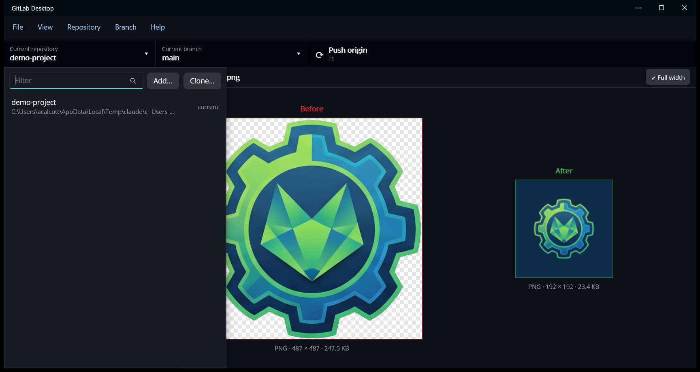
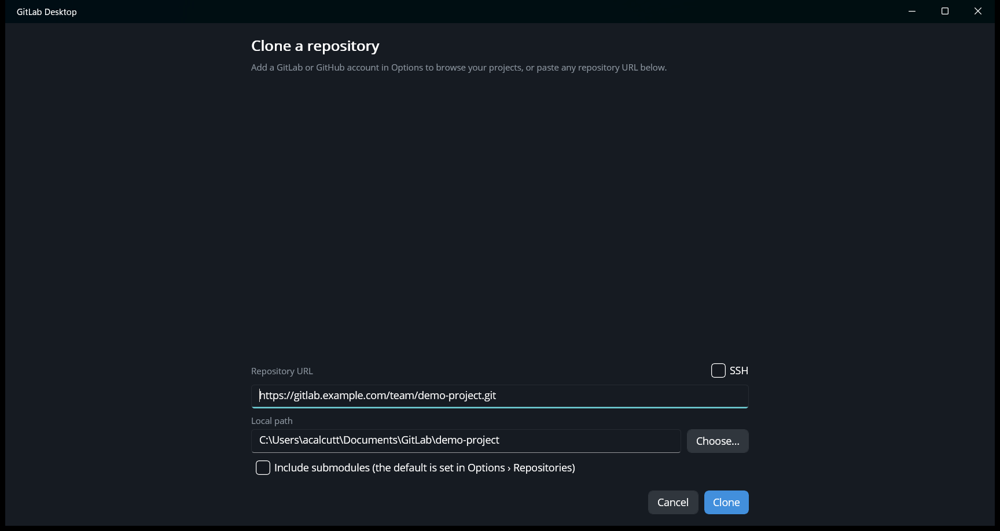
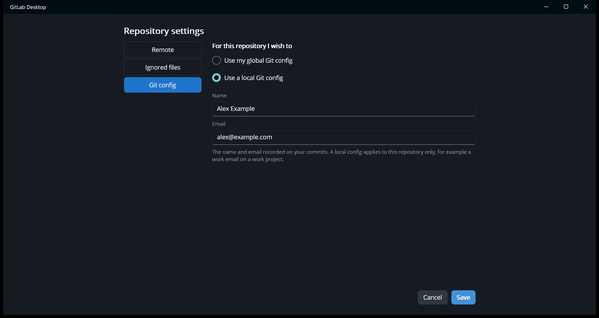

# Repositories

## The repository list

Click **Current repository** in the toolbar (or **View › Repository list**, Ctrl+T) to switch repositories:

Type in **Filter** to narrow the list by name or folder, and press Enter to open the first match. **Add…** and
**Clone…** sit beside the filter. Press Esc or click outside the list to close it.

## Clone a repository

**File › Clone repository…** (Ctrl+Shift+O), or **Clone…** in the repository list:

- With a GitLab or GitHub [account](accounts.md), pick the account to list the projects you can access, then filter
  and click one.
- Or paste any clone URL into **Repository URL**. **SSH** switches a listed project between its HTTPS and SSH URL, and
  is remembered for next time.
- **Local path** is where it goes: your [repositories folder](#the-repositories-folder) plus the project name.
  **Choose…** picks a different parent folder, or edit the path directly. The folder must be empty or not exist yet.
- **Include submodules** also clones the repository's submodules. It starts ticked or not according to
  [Options › Repositories](options.md#repositories), and can be changed for each clone.
- **Clone**. If the server needs a sign-in, the app [asks for one](accounts.md#when-git-asks-you-to-sign-in).

## Add an existing repository

**File › Add local repository…** (Ctrl+O), or **Add…** in the repository list, and pick the folder. Any folder inside a
repository works; the app finds the repository's top folder.

## Create a new repository

**File › New repository…** (Ctrl+N) asks for a name and creates an empty repository with that name in your
repositories folder. To put it on a server, create an empty project there, then set its URL as the remote in
**Repository › Repository settings…** and use **Publish** (see [Syncing](syncing.md)).

## The repositories folder

The repositories folder is where new clones and repositories go by default. Repositories already in it, and one level
of subfolders below it, are added to the repository list automatically. It's `Documents\GitLab` by default. Change it
in [Options › Repositories](options.md#repositories), where **Use GitHub Desktop folder** switches to GitHub Desktop's
`Documents\GitHub`.

**File › Scan repositories folder** looks for new ones right away.

## Repository menu

Right-click **Current repository** in the toolbar for a shorter menu, like GitHub Desktop's: **Copy repository
name**, **Copy repository path** and **Copy remote URL** (handy when telling an AI assistant or a colleague which
repository you mean), plus View on GitLab/GitHub, Open in Terminal, Show in Explorer, Open in editor, Repository
settings and Remove.

| Item | What it does |
| --- | --- |
| **Push / Pull / Fetch** | See [Syncing](syncing.md). |
| **Remove…** | Removes the repository from the list. The files on disk are not deleted. |
| **View on GitLab / GitHub / *server*** (Ctrl+Shift+G) | Opens the project's page in your browser. |
| **Open in Terminal** | A terminal in the repository folder. |
| **Show in Explorer / Finder** (Ctrl+Shift+F) | The repository folder. |
| **Open in editor** (Ctrl+Shift+A) | Opens the folder with your editor command (`code` by default; see [Options › Tools](options.md#tools)). |
| **Create issue** (Ctrl+I), **View issues**, **View merge requests / pull requests**, **View pipelines / Actions** | The project's pages on GitLab or GitHub. |
| **Repository settings…** | The remote's URL, the `.gitignore`, and the name and email for commits. See [Repository settings](#repository-settings). |

The app refreshes a repository whenever its window regains focus, so changes made in your editor or a terminal show
up when you switch back. **View › Refresh** (F5) refreshes right away.

## Repository settings

**Repository › Repository settings…** has three sections:

- **Remote**: the URL of the `origin` remote, where Push, Pull and Fetch go. Changing it also changes which GitLab or
  GitHub project the links and merge/pull requests are for.
- **Ignored files**: edit the repository's `.gitignore`, one pattern per line (for example `bin/` or `*.log`). Files
  git already tracks aren't affected. To ignore a single changed file, right-click it in the Changes tab instead.
- **Git config**: the name and email recorded on your commits. **Use my global Git config** uses the ones set for
  all your repositories. **Use a local Git config** sets them for this repository only, for example a work email on
  a work project. Switching back to global removes this repository's own name and email.
